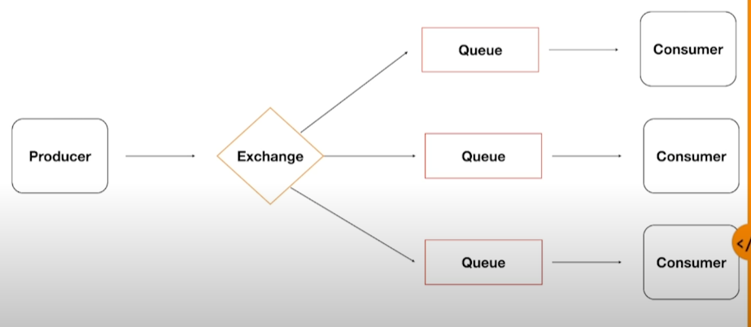
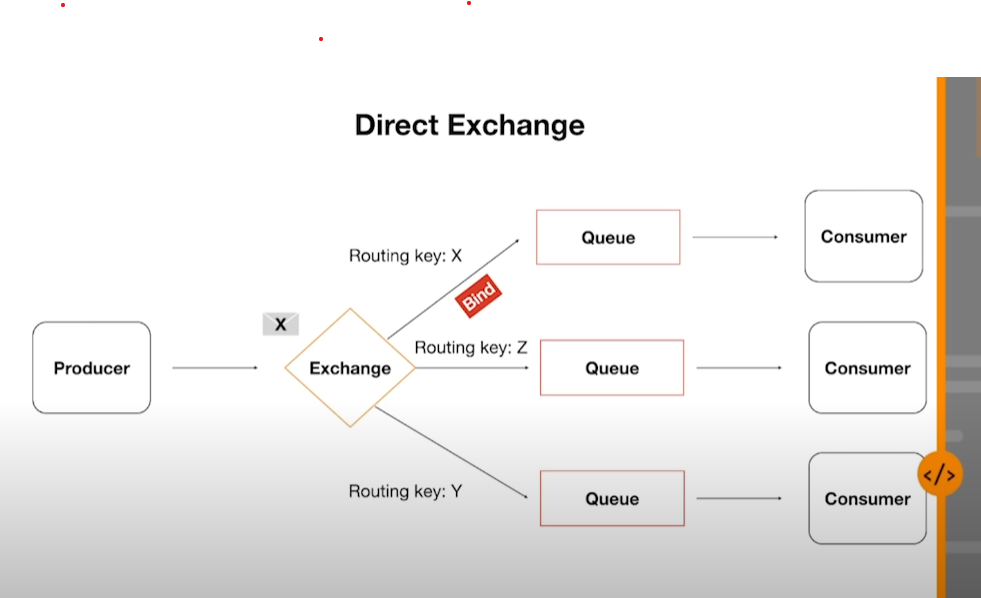
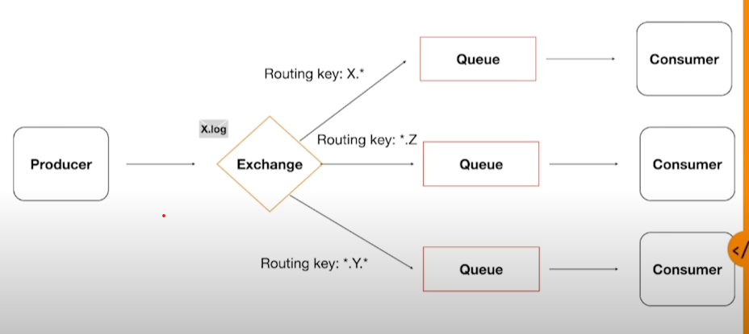
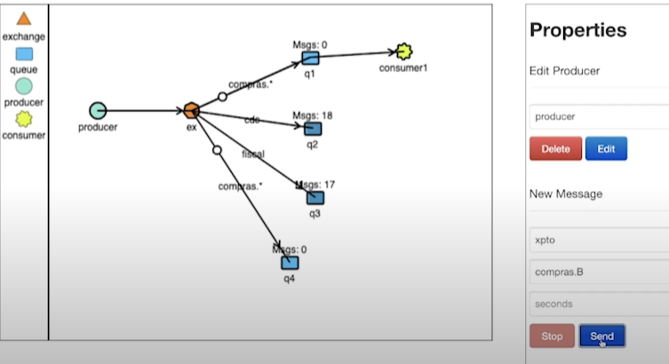
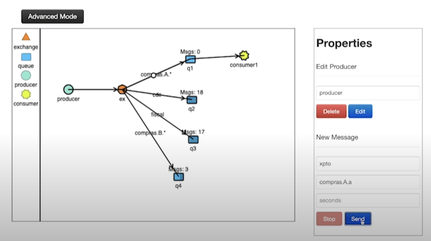

### RABBIT

- Simulador: https://tryrabbitmq.com/
- Video: https://www.youtube.com/watch?v=2YWHtbZJ0QI

##### Exchanges
- Sempre uma mensagem é enviada via rabbitmq, ela não é enviada para uma fila de outro sistema ler, mas sim para uma exchange. Sendo ela responsável por encaminhar as mensagens para as mais diversas filas.

###### Tipos de exchange:
- **Direct**

  Imagine que temos o **Producer** (sistema que emite a mensagem. ex: confirmação de compra);
  
  A mensagem precisa ser lida por 3 diferentes **Consumers** (sistemas);
  
  Como faço para que os 3 sistemas consigam ler a mensagem ? 
    Tendo 3 filas, 1 para cada consumidor.
    Obs.: Precisamos de 1 fila para cada, pois a mensagem ao ser lida, ela é excluída.
  
  E para a mensagem chegar nessas 3 filas, temos a **Exchange**.

  Não necessariamente essa mensagem tem que ir para todas as filas;
  
  Posso ter uma determinada mensagem que só vai para um dos consumers;

  **Bind**
  
  Usamos o bind para conectar o exchange a um fila. Ao fazer isso, criamos o **Routing Key**.

  O **Routing Key** é uma chave que colocamos, e toda vez que eu enviar uma mensagem que contenha aquela chave, a **Exchange** saiba para qual fila enviar aquela mensagem.

- **Fanout** 

  Diferente da Direct, quando a **Exchange** recebe uma mensagem, ela encaminha para **todas** as filas.

- **Topic**

  Uma das **Exchange** mais flexiveis, pois conseguimos brincar com as **Routing Keys**

  Imagine que temos diversos sistemas, e esses podem ter relações com regras.

  

  

  

- Headers -> 

